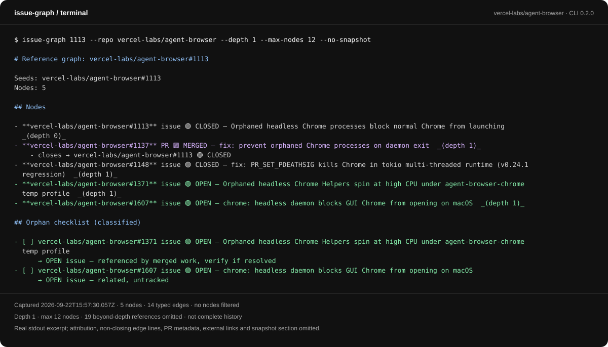

# issue-graph

<p>
  <a href="https://vercel.com/labs#active-experiments"></a>
  <a href="https://www.npmjs.com/package/issue-graph"></a>
  <a href="LICENSE"></a>
</p>

Find related GitHub issues, competing pull requests, and unresolved follow-ups before you start work.

`issue-graph` follows text mentions and GitHub's structural links across repositories. Use it to inspect one issue's neighborhood, count open PRs by author and project, or turn a backlog into a verification queue. Crawling, classification, and ranking need no model. Root-cause clustering is an optional agent step.



Public reference data captured on September 18, 2026, not a live feed. Reproduce it with the bounded graph command below.

## Start here

The supported installation today is from source and requires access to the **INTERNAL** `vercel-labs/issue-graph` repository. For source development, use [Node.js](https://nodejs.org) 20.19.x or 22.12+ (24 recommended), [pnpm](https://pnpm.io), and an authenticated [GitHub CLI](https://cli.github.com). The compiled CLI's runtime requirement remains Node.js 20 or later. Without repository access, this installation path is not available yet.

```bash
gh auth login
gh auth status
gh repo clone vercel-labs/issue-graph
cd issue-graph
pnpm install --frozen-lockfile
pnpm build
pnpm link --global
issue-graph --help
```

Run a bounded graph around [portless PR #427](https://github.com/vercel-labs/portless/pull/427), a public example, without saving a snapshot:

```bash
issue-graph 427 --repo vercel-labs/portless --depth 1 --no-snapshot
```

Read the nodes, typed references, and cleanup candidates, then check for failed fetches, node caps, and unexpanded hubs before drawing conclusions. Results reflect live GitHub evidence, not a fixed demo output.

### Registry installation: pending publication

The public unscoped `issue-graph@0.1.0` is ctate's “Coming soon” placeholder and has no CLI `bin`. **`pnpm dlx issue-graph` does not run this tool today.** These are intended commands only after a functional unscoped release is confirmed:

```bash
pnpm dlx issue-graph --help
pnpm add --global issue-graph
```

The source checkout declares `issue-graph@0.2.0`, the selected release candidate. Publication is still pending; this metadata is not evidence that the registry CLI is available. Use pnpm for source development and Node.js to run the compiled CLI.

## Choose a workflow

| Need | Installed command |
| --- | --- |
| Inspect an issue or PR before starting work | `issue-graph 427 --repo vercel-labs/portless --depth 1 --no-snapshot` |
| Survey labeled open issues | `issue-graph --label bug --repo owner/repo --prioritize` |
| Count open PRs by author | `issue-graph status --repo vercel-labs/portless --author ctate,Railly` |
| See PR evidence, assignees, and requested reviewers | `issue-graph status --repo vercel-labs/portless --author ctate --view prs` |
| Reconcile an open backlog, with or without labels | `issue-graph reconcile --repo owner/repo --format json --no-snapshot` |
| Select the next backlog action | `issue-graph plan --repo owner/repo --format json` |
| Inspect the machine contract | `issue-graph schema` |

Graph mode prints Markdown, even when piped; `--json PATH` writes a graph file. Reconcile and plan default to Markdown in a terminal and versioned JSON in a pipe. Status defaults to a terminal table or JSON in a pipe; its `--json` is a boolean stdout flag, not a filename.

## Explore and compare

Export a graph and a self-contained HTML explorer:

```bash
issue-graph 427 --repo vercel-labs/portless --depth 1 --no-snapshot --json graph.json --html graph.html
```

Open `graph.html` in a browser. It includes typed relationships, node evidence, a cleanup checklist, and an Impact view projecting relationships visible in this graph. No server is needed. Impact is not proof of causality.

Graph and reconcile runs save local history under `~/.issue-graph/` by default. Re-running the same graph seeds shows a snapshot diff; reconciliation tracks repository-level action changes. `--no-snapshot` skips saving history but does not prevent explicitly requested JSON or HTML exports. Plan writes no snapshots.

Status history is opt-in:

```bash
issue-graph status --repo vercel-labs/portless --author ctate,Railly --save
issue-graph status --repo vercel-labs/portless --author ctate,Railly --since last --save
```

Status reports unknown counts as `?` or `null`, never a fabricated zero. Check coverage before using totals. Approval is not merge readiness: status does not inspect CI checks or coding-review threads, and a missing PR is not assumed merged.

## Agents and integrations

The [repository skill](skills/issue-graph/SKILL.md) is an evergreen discovery stub. It tells agents to load the operational guidance bundled with their CLI before running commands, so copied skills do not retain stale workflow instructions. The core routes counts to status, linked work to graph mode, and backlog actions to reconcile or plan.

**The new `skills` command requires a build from this source checkout until the next release.** No package version bump or release is implied. After building, use `node dist/bin.js skills get core`, or the following commands if `issue-graph` already points to that build:

```bash
issue-graph skills list
issue-graph skills get core
issue-graph skills get core --full
issue-graph skills --help
```

`skills` alone lists available guidance. `get core` returns the compact core; `--full` includes its workflow references. These commands read package-relative assets, independent of the working directory, without network or `gh` access. Output stays plain text/Markdown even in a pipe; add `--json` for a versioned envelope. See [Agents](apps/docs/content/docs/agents.mdx) for the JSON contract and setup details.

Copy or symlink only `skills/issue-graph` into your agent's supported project skill directory, checking for existing local changes first, or ask the agent to read that file directly. Installing a skill does not install the CLI or authenticate GitHub. If the command or bundled guidance is unavailable, report the CLI/skill mismatch rather than inventing instructions or automatically installing/upgrading anything.

Use `--cluster` to print a root-cause clustering task for the calling agent. `--cluster-run claude` or `--cluster-run codex` sends it to an installed headless agent. Review the payload and the agent's permissions and data policy before using private repository evidence; the CLI does not sandbox that process.

The library separates the runtime-agnostic core from shell (`gh`) and HTTP (`fetch` plus token) transports. Current source consumers use a built local file dependency named `issue-graph`. Registry availability must be verified separately; local builds and skill discovery are not evidence of publication.

## Documentation

The docs site at [issue-graph.dev/docs](https://issue-graph.dev/docs) is forthcoming. The content is available in this checkout:

- [Get started](apps/docs/content/docs/get-started.mdx): installation, authentication, and a first result
- [Graph](apps/docs/content/docs/graph.mdx): depth, caps, snapshots, and HTML
- [Status](apps/docs/content/docs/status.mdx): counts, coverage, and history
- [Backlog](apps/docs/content/docs/backlog.mdx): reconcile and plan
- [Agents](apps/docs/content/docs/agents.mdx): skill setup and optional clustering
- [Library](apps/docs/content/docs/library.mdx): core, shell, and HTTP integrations
- [Security](apps/docs/content/docs/security.mdx): permissions and private data
- [Reference](apps/docs/content/docs/reference.mdx): commands and output contracts

## Limits and privacy

The CLI is read-only **on GitHub**, not side-effect-free locally. Graphs are bounded by depth, node caps, hubs, permissions, and per-node API limits. Shared files or closing targets are candidates for review, not guarantees of duplicate accuracy, correctness, or scope parity. Verify current code and behavior before closing or merging anything.

Snapshots, exports, logs, and cluster prompts can contain private repository metadata. A self-contained HTML file is portable, not automatically safe to publish. Review content and storage permissions before sharing. See [security guidance](apps/docs/content/docs/security.mdx) and [vulnerability reporting](SECURITY.md).

## Source development

From an authorized checkout, update a source installation with:

```bash
git pull --ff-only
pnpm install --frozen-lockfile
pnpm build
pnpm link --global
```

Contributor checks:

```bash
pnpm check
pnpm test:package
```

`pnpm build` emits the Node CLI and library in `dist`. By default, package verification builds and exercises a packed local installation; supplied-tarball mode tests an existing archive without rebuilding. Neither is evidence of registry publication. See [Contributing](CONTRIBUTING.md#release-process) for the retained-artifact release process. To compare transports against live GitHub data, use `pnpm exec tsx scripts/verify-transports.ts <number> <owner/repo> <depth>` with appropriate access.

### Local website development

From the repository root, start the docs website on a fixed local port:

```bash
pnpm dev:docs --hostname 127.0.0.1 --port 3399
```

Validate the production build separately. The HTTP suite checks production cache behavior, which differs from the development server:

```bash
pnpm check:docs
pnpm build:docs
pnpm --filter @issue-graph/docs test:ci
```

The last command starts and stops its own test server. For a manual browser session or audit, stop the development server and run `pnpm --filter @issue-graph/docs start --hostname 127.0.0.1 --port 3399`. In another terminal:

```bash
DOCS_TEST_URL=http://127.0.0.1:3399 pnpm test:docs:routes
DOCS_TEST_URL=http://127.0.0.1:3399 pnpm audit:docs
```

The agent-readability audit may follow production canonical URLs even when started against localhost. Before deployment, those requests can fail or inspect a different deployment; a local audit is not necessarily local-only. [is-agentic.com](https://is-agentic.com) requires a publicly reachable URL, not localhost. Audit scores are diagnostic signals, not certification of agent compatibility, accessibility, security, or production readiness.

## License

Apache-2.0
